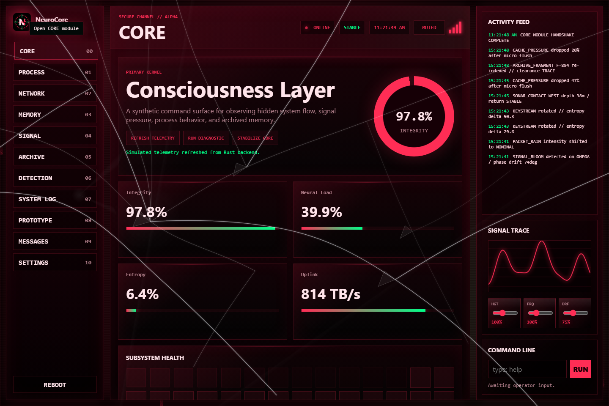
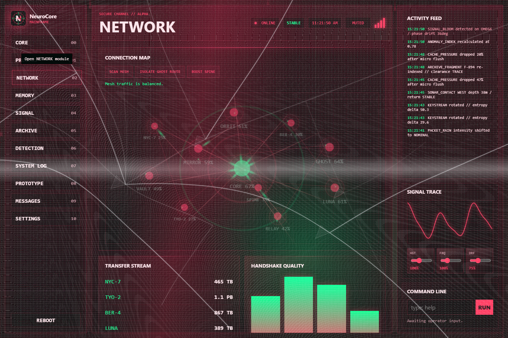
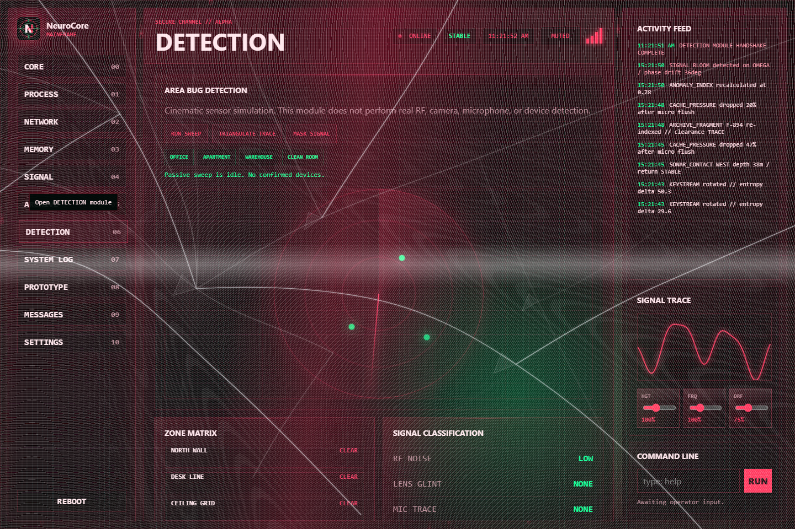
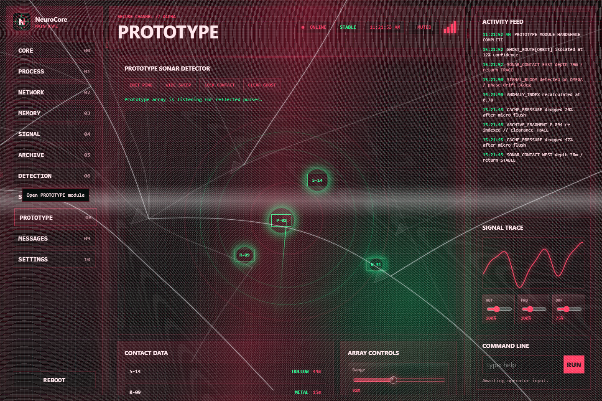
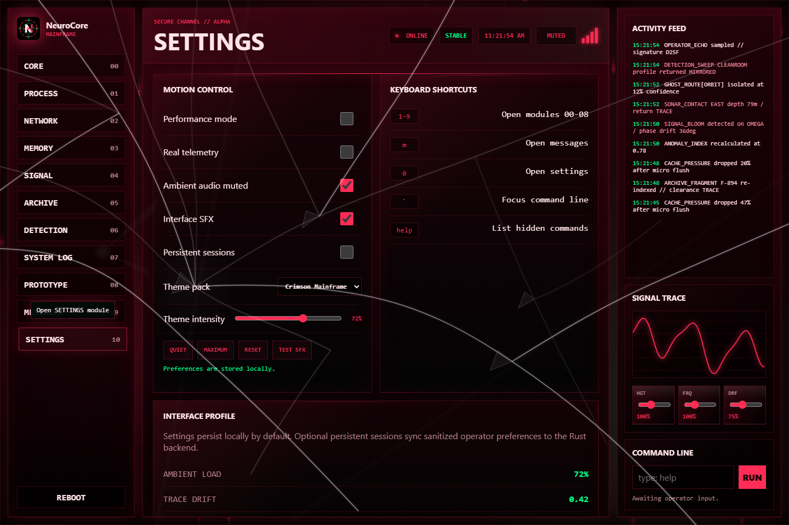

# NeuroCore // MAINFRAME

## Project Status

NeuroCore // MAINFRAME is a private creative prototype and local demonstration project. It is not intended to be a public release, production service, commercial product, open-source collaboration target, or community-maintained package.

This repository is shared as a finished artifact for viewing, learning, and local experimentation only. External issues, feature requests, pull requests, contribution proposals, and release requests are not expected or accepted.

[](backend/Cargo.toml)
[](frontend/package.json)
[](LICENSE)
[](package.json)
[](frontend/public/manifest.webmanifest)

**Access the system beneath the system.**

NeuroCore // MAINFRAME is an immersive web interface prototype built with a Vite frontend and Rust backend. It opens with a cinematic boot sequence, then unlocks into a matrix-inspired command dashboard with live modules, animated telemetry, keyboard shortcuts, hidden commands, and controlled ambient effects.

## Screenshots

### Core Dashboard



### Network Map



### Detection Sweep



### Prototype Sonar



### Settings



Generate or refresh them with:

```bash
npm run screenshots
```

## Features

- Cinematic black-screen boot sequence with typed terminal output.
- Matrix-style canvas rain with cursor-reactive glow.
- Sidebar navigation for CORE, PROCESS, NETWORK, MEMORY, SIGNAL, ARCHIVE, DETECTION, SYSTEM LOG, PROTOTYPE, MESSAGES, and SETTINGS.
- Real-time activity feed and timestamped logs.
- Interactive process rows, archive search, command line, keyboard shortcuts, and persistent settings.
- Optional real telemetry mode for local CPU, memory, and process snapshots through the Rust backend.
- Optional ambient Web Audio drone with a user-controlled mute toggle.
- Drag and resize support for selected panels. Click a panel to select it, drag its heading, and double-click to reset its position.
- Configurable module registry loaded from `frontend/public/config/modules.json`.
- Theme packs loaded from `frontend/public/config/themes.json`.
- Offline-ready PWA manifest and service worker.
- WebGL depth layer behind the NETWORK map.
- Richer simulated DETECTION room profiles and sweep presets.
- Optional local JSON session persistence via the Rust backend.
- Animated meters, memory grid, network nodes, signal scope, scanning aperture, and status indicators.
- Responsive layout with a focused mobile experience.
- Performance mode and theme intensity controls.
- Custom SVG logo and ICO favicon.

## Contribution Policy

This project is closed to outside contribution. The presence of documentation, tests, hardening notes, and an Apache 2.0 license does not mean the project is seeking maintainers, pull requests, issue reports, release packaging, or support obligations.

## Tech Stack

- Vite
- Vanilla JavaScript modules
- Rust backend powered by Axum
- CSS animations and responsive layout
- Canvas rendering for matrix rain and signal scopes

## Run Locally

```bash
npm install
npm run dev
```

Run these commands from the repository root. `npm run dev` starts both halves of the app:

- Rust backend API: `http://127.0.0.1:8787`
- Frontend site: `http://127.0.0.1:5200`

The frontend proxies `/api/*` requests to the backend during development.

## Build

```bash
npm run build
npm start
```

The production frontend build is emitted to `frontend/dist/`. The Rust backend serves that built site and the API from one process.

## Tests and Visual Checks

```bash
npm run test:api
npm run test:visual:update
npm run test:visual
```

`test:api` starts the Rust backend on an isolated port and validates the main API endpoints. `test:visual:update` captures initial visual baselines in `docs/visual-baselines`; `test:visual` captures current screens and compares them against those baselines.

## Hardening

- Production responses include CSP, anti-framing, no-sniff, referrer, opener, and permissions-policy headers.
- API bodies are capped, module actions are allowlisted, and oversized commands are rejected.
- Local session persistence is sanitized and excluded from source control.
- Frontend API calls use same-origin credentials and no-store caching.

## Folder Structure

```text
neurocore-mainframe/
├── backend/
│   ├── Cargo.toml
│   └── src/
│       ├── main.rs
│       └── services/
├── frontend/
│   ├── index.html
│   ├── package.json
│   ├── vite.config.js
│   ├── src/
│   └── public/
├── README.md
├── .gitignore
├── LICENSE
├── CONTRIBUTING.md
├── CODE_OF_CONDUCT.md
├── SUPPORT.md
├── NOTICE.md
├── SECURITY.md
├── CHANGELOG.md
├── ROADMAP.md
├── docs/
│   ├── ARCHITECTURE.md
│   ├── UI-SYSTEM.md
│   ├── ANIMATIONS.md
│   └── ROADMAP.md
├── scripts/
│   └── dev.mjs
└── package.json
```

## Customization

- Add or edit frontend modules in `frontend/src/modules`.
- Add or edit backend services in `backend/src/services`.
- Adjust global colors in `frontend/src/styles/base.css`.
- Tune layout in `frontend/src/styles/layout.css`.
- Tune module visuals in `frontend/src/styles/modules.css`.
- Modify the boot sequence in `frontend/src/main.js`.
- Reorder or rename modules in `frontend/public/config/modules.json`.
- Add theme packs in `frontend/public/config/themes.json`.
- Replace logo assets in `frontend/public/assets`.

## Hidden Commands

Use the command line in the right rail:

- `help`
- `core`
- `process`
- `network`
- `memory`
- `signal`
- `archive`
- `detection`
- `log`
- `prototype`
- `messages`
- `settings`
- `pulse`
- `quiet`
- `unlock`

## Real Telemetry

Open `SETTINGS` and enable **Real telemetry** to switch CORE and PROCESS from simulated mainframe data to local system snapshots. The browser does not read system information directly; the Rust backend samples local CPU, memory, and process data and sends a sanitized view to the frontend.
